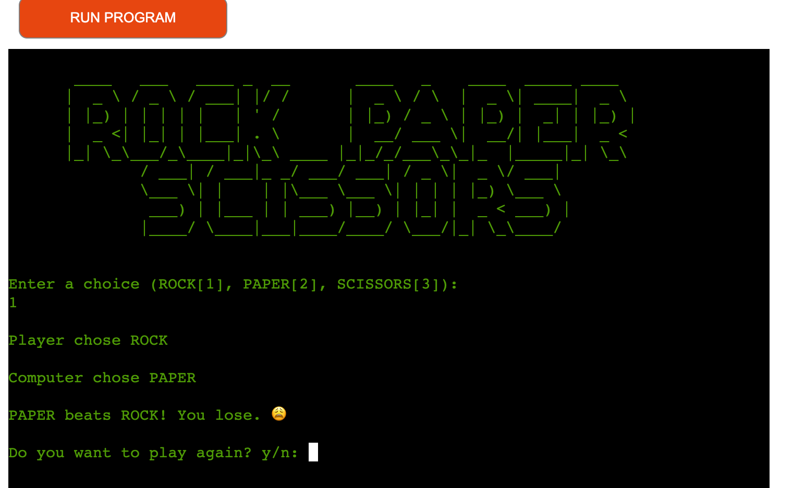

# **RPS Game**

**RPS Game** is a simple command-line option game that will be played aganist computer. Rock Paper Scissors (RPS) is a zero-sum game, typically played by two people using their hands and no tools. Players make hand shapes, each with a certain degree of power, ultimately leading to an outcome. RPS is popular worldwide, played by children and adults alike, and often used to make decisions where no room for cheating or predicting the other person’s move is allowed. 

[Link to live project](https://rock-paper-34a789df3127.herokuapp.com/)

## How to Play:

- The game will display the games title "ROCK PAPER SCISSORS" in ASCII Art with a welcome message "Welcome to the ROCK PAPERS SCISSORS GAME"                                                           
                                                                                                                                            "

- The player is asked to select one of the options presented to play. The options includes.. 
(1)Start Game 
(2)Rules of the Game
(3)Exit the Game"

- Depending on what option the user selected, the game will proceed to show according to the user choice. If user select the option one(1) of Start the Game, the game will start by asking the user to make a choice from the three available options of ROCK, PAPER AND SCISSORS.

- If the player picks second option of rules of the Game, then game will proceed by opening the rules book. At the end of the rules, User will be asked to press Enter to continue, this will bring the user back to the Option page. 

- If the player picked an option that's out of the range of the Options, the Game will respond with "Invalid error" message and prompt the user to enter the correct option in range of the available option.

 

-When the user select the Start game option, they will be presented with the three available game option of: ROCK, PAPER, SCISSIORS... If user pick outside of these options an error message will show up that the option selected is not an RPS game option. The game will continue with the question until user have made the right choice between the options

- The game will continue to show what the user selected and the computer choice as well and also shows who won the rounds. 

- After the round of game is complete the player will be asked if they want to play again. They can only choose either yes or no. "Yes" and the games goes back to question one with the options of:
(1)Start Game 
(2)Rules of the Game
(3)Exit the Game"
If no the game will goes back to the welcome screen and display "Thanks for playing!" If the player types anything else in a message will appear to say "Please enter yes or no"

![]

## Features:

- **Interactive Game** The game offers an interactive gaming experience, allowing the player to choose an answer and received a response straight back. 

- **Random Choice** The player is presented with 3 Random choice questions of ROCK.PAPER.SCISSORS. Each answer determing if you will or lose. 

- **Informative** If the player lose a round, the game tells the player they got it wrong and that the opponent wins. 

- **Play Again Feature** Once the player finished a round, they are giving the option of playing again. 

## Design:

- I originally designed a rough flow chart with a very simple design. Once the website was built and was working made some changes to make it flow better and give the player a better experience. 

## Testing:

- I have manaully tested the project using CI Python Linter with no errors showing. 

- I have used bothe my local termianl and the Heroku website to run the quiz with no errors showing up. 

## Bugs:

- I encountered a bug at the begining of the project on how to use the Enum for my permanent representation of choice of RPS. I had to use stackoverflow website.
- From the above bug I couldn't find a way to represent my user input and the option of what the player might enter as Strings. No matter what  I tried it I kept getting errors. This is something I wish to look at again when I have more experience with Python.
- Because input() returns a string, I need to convert the return value to an integer using int(). Then, I can compare the input to each of the actions. This works well, but it might rely on me naming variables correctly in order to keep track of them. A better way is to use enum.IntEnum and define my own action class!
- Using enum.Enum allows me to create attributes and assign them values similar to those shown in the game. This helps clean up my code by grouping actions into their own namespaces and making the code more expressive.

## Remaining Bugs:

- No Bugs remaining 

## Deployment:

This project was deployed using Heroku. 
- steps for deployment:
    - Create a new Heroku app
    - Set the builds pack to Python and NodeJS in that order
    - Link the Heroku app to my repository
    - Click Deploy

## Credits:

- The Code Institute Love-Sandwiches Project help me learn a lot about Python. 

- The (www.w3schools.com) website helped with trying to figure out how to use the correct code and how to get it to work for me.
- The Stackoverflow website helped with using Enum

- Real Python (https://realpython.com/) - When I was really struggling I was able to  look up few steps from the website 

## Content:

- The ASCII came from the (www.asciiart.eu) website. 
- Flow Chart was designed using the (https://Lucid.app/) website
